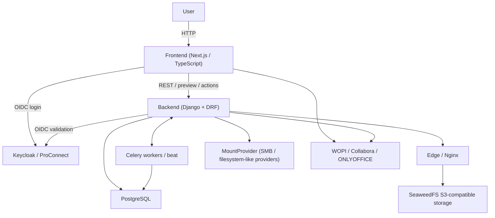

## Architecture

This document is a high-level architecture overview for the `Apoze/drive`
fork.

Important:

- `AGENTS.md` is the source of truth for engineering invariants and agent
  behavior
- this document is intentionally high-level and descriptive
- for environment and E2E execution details, see:
  - `docs/env_freeze_report.md`
  - `docs/WorkDone/e2e/test-execution-contract.md`

### Global system architecture

### Core components

- Frontend:
  - Next.js / TypeScript application
  - explorer, preview, viewers, uploads, sharing, and mount browsing
- Backend:
  - Django + Django REST Framework
  - authorization, item APIs, preview resolution, text endpoints, WOPI,
    async jobs, mount APIs
- Database:
  - PostgreSQL for application state
- Async processing:
  - Celery workers and beat for long-running or scheduled operations
- Storage:
  - SeaweedFS S3-compatible object storage for regular Drive items
- Mounts:
  - MountProvider abstraction for filesystem-like backends such as SMB and
    future providers
- Editors:
  - WOPI-based integrations including Collabora and ONLYOFFICE

### Storage model

There are two distinct storage families in this fork:

- Regular Drive items:
  - stored through Django Storage on top of S3-compatible object storage
  - no local path assumption
  - S3 access can be direct and must stay encapsulated in S3-specific paths
- Mount-backed entries:
  - exposed through MountProvider
  - must rely on provider APIs and resolved capabilities
  - must not branch on provider brand such as SMB vs other future providers

Important rule:

- S3 is not a MountProvider backend
- shared user-visible features should aim for parity across regular items and
  mounts when safe and supportable, with explicit capability gating when not

### Preview, viewers, and editing

- Viewer routing should stay explicit and conservative
- Archive viewers must rely on explicit allowlists
- Text viewer eligibility is determined by backend text endpoints
- WOPI flows must preserve streaming behavior, especially for PutFile
- Mount preview behavior should converge toward the regular item UX through
  capability-aware contracts, not storage-specific shortcuts

### Network surfaces

Typical local surfaces are:

- frontend UI
- backend API
- edge / nginx public media and preview surfaces
- SeaweedFS S3 endpoint
- editor endpoints for Collabora / ONLYOFFICE

Exact local and E2E origins are documented in:

- `docs/env_freeze_report.md`
- `docs/WorkDone/e2e/test-execution-contract.md`

### E2E model

The current local CI-like E2E contract uses:

- `ENV_OVERRIDE=e2e`
- stable loopback origins on `127.0.0.1`
- Playwright in a dedicated Ubuntu-based runner container
- local default `PLAYWRIGHT_WORKERS=4`

The LAN dev stack and the CI-like local E2E stack intentionally use different
browser-facing origins. Use the dedicated docs above as the source of truth.

### Recommended companion docs

- `AGENTS.md`
- `README.md`
- `docs/env_freeze_report.md`
- `docs/WorkDone/e2e/test-execution-contract.md`
- `docs/mounts-preview-correction-plan.md`
