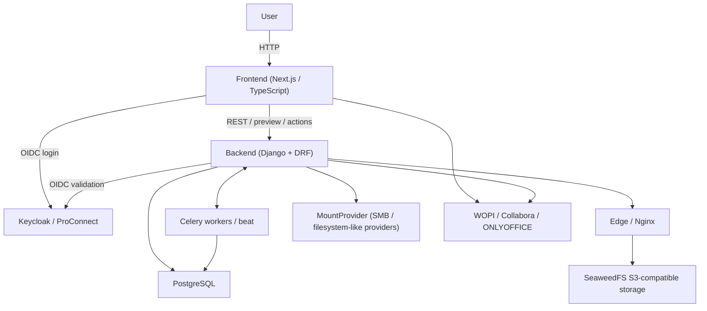

## Architecture

This document is a high-level architecture overview for the `Apoze/drive`
fork.

Important:

- `AGENTS.md` is the source of truth for engineering invariants and agent
  behavior
- this document is intentionally high-level and descriptive
- for environment and E2E execution details, see:
  - `docs/env_freeze_report.md`
  - `docs/WorkDone/e2e/test-execution-contract.md`

### Global system architecture

```mermaid
flowchart TD
    User -- HTTP --> Front["Frontend (Next.js / TypeScript)"]
    Front -- REST / preview / actions --> Back["Backend (Django + DRF)"]
    Front -- OIDC login --> OIDC["Keycloak / ProConnect"]
    Back -- OIDC validation --> OIDC
    Back --> DB["PostgreSQL"]
    Back <--> Celery["Celery workers / beat"]
    Celery --> DB
    Back --> Edge["Edge / Nginx"]
    Edge --> S3["SeaweedFS S3-compatible storage"]
    Back --> Mounts["MountProvider (SMB / filesystem-like providers)"]
    Front --> Editors["WOPI / Collabora / ONLYOFFICE"]
    Back --> Editors
```

### Core components

- Frontend:
  - Next.js / TypeScript application
  - explorer, preview, viewers, uploads, sharing, and mount browsing
- Backend:
  - Django + Django REST Framework
  - authorization, item APIs, preview resolution, text endpoints, WOPI,
    async jobs, mount APIs
- Database:
  - PostgreSQL for application state
- Async processing:
  - Celery workers and beat for long-running or scheduled operations
- Storage:
  - one or more native Django Storage/S3 connections for regular Drive items
- Mounts:
  - MountProvider abstraction for filesystem-like backends such as SMB and
    future providers
- Editors:
  - WOPI-based integrations including Collabora and ONLYOFFICE

### Storage model

The common explorer exposes named virtual spaces. A connection represents an
S3 bucket/prefix or a filesystem provider; a namespace identifies physical data
shared by aliases. Space grants authorize users and local Django groups on
whole roots or subfolders. Accounting ownership grants no access. Application
budgets for the instance, organization, connection, space and user remain
independent of physical NAS capacity.

Items retain an explicit connection, logical space and object-key location.
Native files retain an indexed resource UUID, physical identity and observed
version. Transfers preserve the logical reference only after verified
publication; private source retention and durable journals make interrupted
operations recoverable. API, worker and scheduler must run compatible code.

Drive administers connections, spaces, grants and recovery. ST administers
the independent quota policies and exposes their application revision. The
storage vault is backed up separately from its encrypted database records.

Native document creation and conversion reuse the governed writers. ZIP creation
and ZIP/TAR extraction reuse file and directory journals across both families;
archive members are validated before publication and processed in bounded passes.
Public folder exports stream under current share and subtree permissions.

There are two distinct storage families in this fork:

- Regular Drive items:
  - stored through Django Storage on top of S3-compatible object storage
  - no local path assumption
  - S3 access can be direct and must stay encapsulated in S3-specific paths
- Mount-backed entries:
  - exposed through MountProvider
  - must rely on provider APIs and resolved capabilities
  - must not branch on provider brand such as SMB vs other future providers

Important rule:

- S3 is not a MountProvider backend
- shared user-visible features should aim for parity across regular items and
  mounts when safe and supportable, with explicit capability gating when not

### Preview, viewers, and editing

- Viewer routing should stay explicit and conservative
- Archive viewers must rely on explicit allowlists
- Text viewer eligibility is determined by backend text endpoints
- WOPI flows must preserve streaming behavior, especially for PutFile
- Mount preview behavior should converge toward the regular item UX through
  capability-aware contracts, not storage-specific shortcuts

### Network surfaces

Typical local surfaces are:

- frontend UI
- backend API
- edge / nginx public media and preview surfaces
- SeaweedFS S3 endpoint
- editor endpoints for Collabora / ONLYOFFICE

Exact local and E2E origins are documented in:

- `docs/env_freeze_report.md`
- `docs/WorkDone/e2e/test-execution-contract.md`

### E2E model

The current local CI-like E2E contract uses:

- `ENV_OVERRIDE=e2e`
- stable loopback origins on `127.0.0.1`
- Playwright in a dedicated Ubuntu-based runner container
- local default `PLAYWRIGHT_WORKERS=4`

The LAN dev stack and the CI-like local E2E stack intentionally use different
browser-facing origins. Use the dedicated docs above as the source of truth.

### Recommended companion docs

- `AGENTS.md`
- `README.md`
- `docs/env_freeze_report.md`
- `docs/WorkDone/e2e/test-execution-contract.md`
- `docs/mounts-preview-correction-plan.md`

## Messages and Calendars on the LAN

The separate `suite-mail` project uses the common People/ST identity contract
and OIDC providers. Native Messages owns mailbox content, PostgreSQL/S3 blobs
and Celery scheduling; Calendars owns SabreDAV events and uses Dramatiq.
Mailbox grants drive mailbox-calendar ACLs. Personal calendars compose direct
and People-group grants; expired projections fail closed. Scheduling intentions
commit with DAV changes and are dispatched idempotently through Messages.
Drive attachments use the canonical resource/space and publication services,
with S3 and MountProvider kept separate; Docs links retain their permissions.
Meet room creation keeps native ownership and admission. See the
[operations guide](operations/suite-messages-calendars.md) for LAN constraints,
quotas, restore isolation and operational commands.
