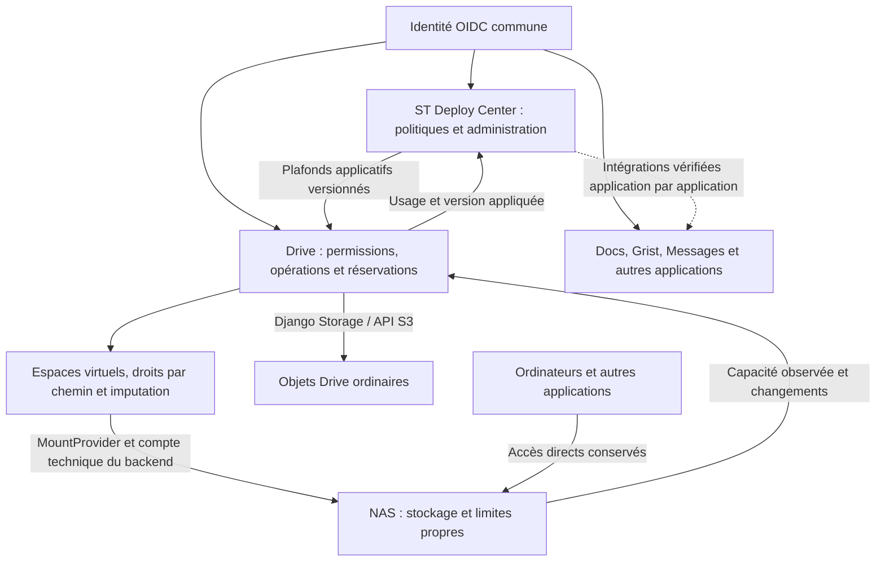

# Drive + ST Deploy Center : proposition de finalisation pour le homelab

Date : 4 septembre 2026. Révision 2 : quotas et séparation virtuels dans Drive,
suivant la correction de l'utilisateur. Statut : proposition, aucune
implémentation. Les constats de code sont issus d'une lecture statique ; les
tests historiques sont distingués des validations à exécuter.

## 1. Décision proposée

Conserver l'intégration déjà livrée et la compléter autour de trois autorités
distinctes, avec une couche applicative indépendante du NAS :

- **ST Deploy Center** définit les organisations, les services activés, les
  plafonds et les exceptions. Il présente leur état d'application.
- **Drive** définit ses espaces virtuels et leurs autorisations, fait respecter
  les quotas applicatifs sur S3 comme sur MountProvider, réserve les octets
  des opérations concurrentes et publie ses compteurs.
- **Le NAS** authentifie un ou plusieurs comptes techniques et impose ses
  propres permissions et limites de stockage. Ces limites restent un plafond
  externe ; elles ne remplacent pas les quotas des utilisateurs Drive.

L'utilisateur confirme un compte NAS partagé par plusieurs utilisateurs Drive,
des dossiers personnels ou partagés créés virtuellement par l'application,
des restrictions par chemin, des plafonds applicatifs globaux et personnels,
ainsi que plusieurs connexions NAS possibles. Aucun compte, dataset ou quota
natif par utilisateur Drive n'est requis. Les accès directs au NAS restent
possibles et leurs changements sont rapprochés avec l'inventaire applicatif.

Le quota Drive est obligatoire dans le périmètre configuré, même si le serveur
SMB ne sait exposer aucun quota. La télémétrie NAS sert à borner les plafonds
configurables et à anticiper les refus physiques. Les modifications directes
restent soumises aux règles du NAS ; Drive en comptabilise les effets après
observation, sans prétendre pouvoir les refuser avant qu'elles arrivent.

Le socle recommandé reste Docker Compose, les deux applications existantes,
leur PostgreSQL et les providers déjà intégrés. Aucun nouveau
microservice de quotas ni moteur d'orchestration de conteneurs n'est nécessaire.

## 2. Point de départ vérifié

### Historique et dépôts

Les quatre tâches fournies ont servi à reconstruire les décisions, livraisons
et validations :

- [Inspection de la boucle quota](codex://threads/019fc1d1-9b56-7ea3-80fb-f99799fe51ce).
- [Contexte initial Drive et déploiement](codex://threads/019f9a2a-2f48-7da3-b21f-b8990a1e204f).
- [Mise en place du fork ST](codex://threads/019fc2b1-7ad1-78e1-9a32-6494613992de).
- [Audit de l'état Drive et ST](codex://threads/019fc2ba-57b6-7b81-8469-643373c0de1b).

| Produit | Livraison intégrée | Base de reprise observée |
| --- | --- | --- |
| Drive | [Apoze/drive PR 177](https://github.com/Apoze/drive/pull/177) | `Apoze/drive main`, `4086ae6733d78aa1d7e7bcfc30e01672e4d06a38` |
| ST Deploy Center | [Apoze/st-deploycenter PR 1](https://github.com/Apoze/st-deploycenter/pull/1) | `Apoze/st-deploycenter main`, `7e8542ace7708ac20b1056b03cdc0e010f8778fc` |

Les branches locales ouvertes sont d'anciennes branches de livraison :
`Apoze/drive codex/block-drive-uploads-quota-172` à `a8a93fb8`, et
`Apoze/st-deploycenter codex/st-deploycenter-drive-quota` à `76d9bd63`.
Elles ne constituent pas le point de départ à choisir automatiquement.

Identités des dépôts :

- Drive `origin` : `https://github.com/Apoze/drive.git`, fork personnel,
  fetch/push ; `upstream` : `https://github.com/suitenumerique/drive.git`,
  lecture/fetch uniquement, push désactivé.
- ST `origin` : `https://github.com/Apoze/st-deploycenter.git`, fork personnel,
  fetch/push ; `upstream` : `https://github.com/suitenumerique/st-deploycenter.git`,
  lecture/fetch uniquement, push désactivé.

La spécialisation Drive reste indépendante de
`https://github.com/suitenumerique/drive.git`. La finalisation ne nécessite ni
rattrapage général de ce dépôt officiel, ni proposition de fusion vers lui.
Les adaptations ST doivent rester faciles à isoler si une contribution au
dépôt officiel est souhaitée ultérieurement, sans en faire un prérequis.

Des modifications locales de documentation et des fichiers non suivis existent
dans les deux répertoires ; les préserver. Le travail activité `#176` vit dans
`/root/Apoze/drive-worktrees/activity-log-core-176` et reste indépendant.

### Ce qui existe déjà

La boucle Drive → métriques → ST → droits/quota → Drive a été livrée, avec
configuration des plafonds par défaut et blocage d'uploads. L'historique
rapporte 2 200 tests backend Drive et 618 tests backend ST réussis, ainsi qu'une
validation réelle avec modification des plafonds. Une validation Drive après
fusion existe dans [cette exécution GitHub Actions](https://github.com/Apoze/drive/actions/runs/30763729787).
Ce sont des preuves historiques, pas des résultats de cette recherche.

Au relevé de cette étude, les services Docker des deux projets sont arrêtés.
La configuration locale de raccordement existe. Aucune remise en route, aucun
test produit, aucune modification de quota ou de données n'a été effectué ici.

## 3. Constats qui changent le contenu du prochain travail

| Constat vérifié dans le code | Conséquence pour la proposition |
| --- | --- |
| Le compteur Drive additionne `Item.size` par créateur et exclut `hard_deleted_at` | C'est une mesure logique des objets Drive, pas l'occupation réelle du disque ni celle des montages. Définir explicitement corbeille, purge et versions. |
| L'agrégat organisation sélectionne seulement les utilisateurs actifs et leurs claims courants | Désactiver un utilisateur ou changer son rattachement peut modifier le compteur sans retirer ses fichiers. Fixer l'entité à laquelle chaque contenu est imputé. |
| L'autorisation d'upload est un booléen mis en cache, sans réservation des octets | Deux opérations peuvent être autorisées avec le même espace disponible. |
| Une URL signée PUT vise la clé finale sans taille attendue liée à la signature dans le générateur actuel | Une réservation dans PostgreSQL ne suffit pas à contrôler le cycle complet de l'objet. |
| PutFile WOPI vers S3 utilise le streaming existant sans contrôle de quota visible à cet endroit | L'upload navigateur n'est qu'un des chemins d'écriture à couvrir. |
| Des sauvegardes de texte et WOPI sur montage ouvrent directement la destination en écriture | Un refus de quota ou un disque plein peut interrompre une sauvegarde après modification de l'original ; la sûreté des écritures est préalable. |
| ST donne priorité à l'exception individuelle avant de décider sur le plafond organisation | Une exception personnelle peut contourner le plafond commun. La nouvelle règle doit être explicitement définie pour Drive. |
| Le PATCH individuel d'un entitlement n'utilise pas la validation stricte des configurations imbriquées dans une souscription | Réutiliser une validation commune pour toutes les entrées et vérifier les rattachements autorisés. Il ne suffit pas de valider le formulaire. |
| Le protocole ST de résolution exige un SIRET alors que le modèle organisation possède déjà un UUID | Introduire un identifiant générique compatible avec un homelab, en conservant le protocole SIRET existant. |
| Le bootstrap de démonstration réécrit l'activation et les quotas Drive à chaque passage | Il ne convient pas comme procédure de mise à jour de production. |
| Le Dockerfile frontend ST ne contient actuellement qu'un environnement de dépendances | Le packaging de production ST reste à compléter. |

Ces constats indiquent des mécanismes à corriger ou à tester ; ils ne sont pas
présentés comme des incidents reproduits sur les données de l'utilisateur.

Repères locaux pour une future implémentation :

- [Calcul des octets Drive](/root/Apoze/drive/src/backend/core/storage/creator_storage_compute_backend.py:14).
- [Agrégation et communication ST](/root/Apoze/drive/src/backend/core/entitlements/backends/deploycenter.py:64).
- [Jauge et lecture de la limite](/root/Apoze/drive/src/backend/core/entitlements/backends/deploycenter.py:166).
- [URL signée d'upload](/root/Apoze/drive/src/backend/core/api/utils.py:104).
- [Finalisation d'upload](/root/Apoze/drive/src/backend/core/api/viewsets.py:1422).
- [Streaming S3 WOPI](/root/Apoze/drive/src/backend/wopi/viewsets.py:476).
- [Écriture WOPI sur montage](/root/Apoze/drive/src/backend/wopi/viewsets.py:778).
- [Écriture texte sur montage](/root/Apoze/drive/src/backend/core/api/viewsets.py:5162).
- [Transaction d'écriture montage existante](/root/Apoze/drive/src/backend/core/services/mount_write_transaction.py:121).
- [Priorité des exceptions ST](/root/Apoze/st-deploycenter/src/backend/core/entitlements/resolvers/entitlement_resolver.py:194).
- [Serializer du PATCH entitlement](/root/Apoze/st-deploycenter/src/backend/core/api/serializers.py:389).
- [Résolution ST par SIRET](/root/Apoze/st-deploycenter/src/backend/core/api/viewsets/entitlements.py:46).
- [Bootstrap de démonstration](/root/Apoze/st-deploycenter/src/backend/core/management/commands/demo_data.py:145).
- [Dockerfile frontend ST](/root/Apoze/st-deploycenter/src/frontend/Dockerfile:1).

## 4. Architecture et règles fonctionnelles



S3 reste l'accès Storage ordinaire de Drive. Il ne devient pas un
MountProvider. ST ne reçoit ni fichiers ni accès générique au moteur Docker.
Les bases de données ne deviennent pas une API commune entre applications.

### Qui décide et qui mesure

| Objet | Autorité proposée | Règle |
| --- | --- | --- |
| Connexion et identité | IdP existant ; Keycloak si aucun IdP approprié n'existe | Une identité stable, des clients OIDC distincts et des redirections exactes. |
| Organisation, activation d'un service, quota configuré | ST Deploy Center | Une politique versionnée et des changements audités. |
| Autorisation d'accès à un fichier | Application propriétaire / ACL du stockage | Être administrateur ST ne donne pas automatiquement accès aux fichiers. |
| Connexions de stockage, espaces virtuels et droits sur les chemins | Drive | Identifiants stables et contrôle serveur ; administration exposable dans ST via les API Drive autorisées. |
| Usage logique S3 et montages dans le périmètre Drive | Drive | Imputation indépendante de la visibilité, réservations communes et rapprochement avec les fichiers réels. |
| Limites natives et capacité physique | NAS | Autorité extérieure, observée en lecture seule si possible ; aucun quota utilisateur Drive n'est traduit automatiquement en quota NAS. |
| Membres et équipes transverses | People si les usages le nécessitent | Définir un sens de synchronisation ; aucun double maître implicite. |

### Organisation et identité du homelab

Partir d'une organisation homelab avec l'UUID déjà disponible dans ST. Ajouter
un sélecteur `organization_id` au protocole ; exactement un sélecteur accepté
par requête, avec maintien du SIRET pour les installations existantes. Adapter
aussi les métriques, le rapprochement des comptes et le bootstrap : renommer
un claim côté Drive seul ne résout pas la dépendance.

Le service appelant doit être autorisé pour l'organisation demandée. Un claim
client ou une adresse e-mail ne doit pas permettre de choisir arbitrairement
une autre organisation. Les identités doivent s'appuyer sur une référence
stable issue de l'IdP, avec une correspondance explicite si les clients OIDC
reçoivent des sujets différents. L'adresse e-mail reste un attribut modifiable.
Cette distinction suit les garanties de stabilité d'[OpenID Connect](https://openid.net/specs/openid-connect-core-1_0.html#ClaimStability).

Réutiliser les modèles ST `Organization`, `Account`, les rôles et leurs règles
de rapprochement. Une migration doit détecter les collisions avant d'associer
les comptes ; ne pas fusionner automatiquement deux personnes sur la seule
égalité d'une adresse.

### Ce que signifie un quota

Décisions recommandées pour Drive :

- Compter les octets logiques des versions courantes des contenus, plus la
  corbeille jusqu'à suppression définitive logique. Les versions conservées,
  temporaires et purges en attente figurent dans un budget physique distinct.
- Conserver une imputation stable à l'organisation et à l'utilisateur ou à
  l'espace. La désactivation d'un compte n'efface pas ses octets.
- Lors d'un transfert d'imputation, réserver chez le destinataire et déplacer
  la charge dans une transaction ; ne pas compter le même objet deux fois.
- Une exception personnelle remplace le plafond personnel par défaut. Le
  plafond de l'organisation et celui de l'espace continuent à s'appliquer.
- Distinguer explicitement « hérité », « limité à N octets », « illimité » et
  « aucune croissance autorisée ». Préserver l'ancien sens de zéro lors de la
  migration, sans le réinterpréter silencieusement comme une interdiction.
- Au-dessus d'un plafond nouvellement abaissé : conserver les données, permettre
  les lectures et suppressions autorisées, refuser les nouvelles augmentations.
- Définir si les réservations déjà admises sont honorées après une baisse.
  Recommandation : les honorer jusqu'à leur échéance encadrée et afficher cet
  engagement ; réserver l'annulation forcée à une action explicite.

Les unités sont explicites : octets dans les contrats, choix lisible Go/Gio
dans l'interface. Les nombres doivent rester exacts sur tout le trajet
PostgreSQL → JSON → JavaScript. La capacité numérique des métriques ST doit
être alignée avec les limites acceptées par son API.

### Budget global de Drive et budget de toute la suite

Drive peut et doit appliquer un plafond global unique à ses espaces S3 et
MountProvider, ainsi qu'un plafond personnel cumulé sur plusieurs backends.
Ces opérations passent par la même autorité applicative et ses réservations.
Il n'est pas nécessaire de répartir ce quota en quotas NAS.

La limite évoquée ici concerne seulement plusieurs applications indépendantes
de la suite et les écritures externes. Leur total de tableau de bord ne
constitue pas un quota strict commun si elles ne partagent pas l'admission.

Pour plusieurs applications indépendantes, les enveloppes par application
restent une solution initiale. À l'intérieur de Drive, distinguer les plafonds
d'usage des allocations réservées : deux utilisateurs autorisés à utiliser
tout un même espace n'obtiennent pas chacun une réservation de sa capacité.
La consommation commune et les réservations d'opérations restent bornées par
le parent. Les unités physiques et logiques restent séparées.

Un pool global flexible utilisable simultanément par tous les services
demanderait une autorité de réservation commune, ou une seule autorité de
stockage avec le même périmètre. Ce n'est pas nécessaire pour terminer
l'intégration Drive/ST proprement. Il ne faut pas le simuler avec une addition
de compteurs périodiques.

## 5. Lever la limite des quotas d'admission dans Drive

### Réserver avant d'autoriser la croissance

Pour chaque plafond fini concerné, l'admission doit respecter :

```text
octets utilisés + octets réservés + croissance demandée <= plafond appliqué
```

Exemple : avec 900 Mio utilisés sur 1 024 Mio, deux transferts simultanés de
100 Mio ne peuvent pas tous les deux réserver leur place. Le premier réserve
100 Mio ; le second voit seulement 24 Mio disponibles et reçoit un refus
explicite. Pour remplacer un fichier de 80 Mio par 100 Mio, la croissance
logique est de 20 Mio ; le besoin physique temporaire est calculé séparément.

La réservation doit être persistée dans PostgreSQL avec un identifiant
d'opération unique, les périmètres débités, les octets réservés, la version de
politique et son état. Verrouiller brièvement les compteurs concernés dans un
ordre stable, puis sortir de la transaction avant tout transfert réseau.
Réutiliser les transactions Django et les contraintes SQL ;
[`select_for_update`](https://docs.djangoproject.com/en/5.2/ref/models/querysets/#select-for-update)
fournit le verrouillage de lignes nécessaire avec PostgreSQL.

Le même mécanisme s'applique aux espaces virtuels NAS. Les périmètres sont
le global Drive/organisation, le backend concerné, l'espace et ses parents,
puis le titulaire auquel les octets sont imputés, avec son plafond personnel
global et éventuellement son plafond sur ce backend. Vérifier les droits
d'accès séparément ; un droit sur un fichier n'en transfère pas la charge.

L'API interne reste petite : admettre une opération, ajuster sa réservation
si nécessaire, confirmer le résultat, annuler. Les détails de concurrence et
de reprise restent dans ce service. Les viewsets, tâches asynchrones et WOPI
conservent leurs contrôles de permission et lui délèguent la comptabilité.

### Cycle complet et cas de panne

1. Résoudre la ressource et son imputation, vérifier les droits et la politique
   appliquée, puis créer ou retrouver la réservation idempotente.
2. Écrire dans une destination non publiée, en streaming borné. Pour une taille
   inconnue, réserver une borne sûre ou obtenir chaque extension avant
   l'écriture des octets correspondants.
3. Vérifier la taille réelle, la version attendue de la destination et le
   résultat du stockage. Une taille annoncée par le navigateur n'est pas une
   preuve suffisante.
4. Publier le résultat et enregistrer durablement l'état permettant de terminer
   ou réparer la transition entre stockage et base. Confirmer une seule fois
   les compteurs et libérer le reliquat réservé.
5. En cas d'échec, préserver l'original, nettoyer les temporaires et annuler la
   charge. Les reprises et notifications répétées retrouvent la même opération.

Il n'existe pas de transaction SQL atomique englobant un serveur S3 ou SMB.
Prévoir des états durables pour les transitions incomplètes et une tâche de
rapprochement. Une réservation expirée ne doit pas être libérée tant qu'une
ancienne écriture peut encore être publiée : invalider la finalisation de
l'ancien acteur, annuler ou isoler son transfert, puis nettoyer. Une échéance
seule ne fournit pas cette garantie.

Limiter aussi le nombre de réservations par compte, leur durée et les uploads
incomplets pour éviter qu'un client monopolise le budget. Le suivi indique les
opérations bloquées et les nettoyages en échec sans exposer les contenus.

### Fermer le cycle des uploads S3 directs

AWS documente qu'une URL présignée est réutilisable jusqu'à son expiration et
qu'une écriture sur une clé existante peut remplacer l'objet. Son expiration
ne suffit donc pas à faire une autorisation à usage unique.
[Documentation S3](https://docs.aws.amazon.com/AmazonS3/latest/userguide/using-presigned-url.html).

Recommandation : conserver le transfert direct lorsqu'il est qualifié, avec
une session d'upload réservée, une destination temporaire privée, et une
finalisation sous le contrôle exclusif du backend. Un multipart dont le
backend possède l'initiation et la complétion est un candidat ; vérifier taille,
parties, rejeu, abandon et exposition de la version réellement validée.
Les mécanismes AWS de [multipart](https://docs.aws.amazon.com/AmazonS3/latest/userguide/mpuoverview.html)
et d'[écriture conditionnelle](https://docs.aws.amazon.com/AmazonS3/latest/userguide/conditional-writes.html)
servent de références, pas de preuve automatique de leur équivalence SeaweedFS.

**Critère de sélection :** après validation, aucune autorisation encore détenue
par le client ne doit pouvoir modifier les octets que Drive expose sous cette
version. L'utilisateur ne possède pas les identifiants S3 du service ni un
accès direct en écriture au bucket interne de Drive.

Si la version du stockage ne permet pas de démontrer ce contrat, utiliser le
streaming borné par le backend pour le mode strict. C'est un coût de trafic à
mesurer, mais une alternative concrète. Ne pas certifier un mode direct sur la
seule compatibilité annoncée « S3 ».

La limite logique porte sur les contenus publiés. Les octets d'un multipart
inachevé consomment du disque avant publication : taille maximale, contrôle
d'admission, cycle de vie des temporaires, marge physique et quotas du stockage
sont également nécessaires.

Le quota de bucket SeaweedFS documenté s'appuie sur un contrôle périodique qui
bascule un bucket dépassé en lecture seule. Il constitue une protection
complémentaire, pas la réservation atomique par utilisateur recherchée ici.
[Documentation SeaweedFS](https://github.com/seaweedfs/seaweedfs/wiki/S3-Bucket-Quota).

### Couvrir toutes les productions d'octets existantes

La future revue des appelants doit couvrir upload initial, renouvellement de
session, finalisation, nouveau fichier, duplication, sauvegarde texte, WOPI,
conversion, archivage/extraction autorisés, import et tâches asynchrones
existantes. Couvrir aussi changements d'imputation, suppression, restauration
et purge. Un parcours absent du produit n'a pas à être créé pour ce chantier.

WOPI doit garder la consommation unique du flux de requête et le protocole de
verrouillage existant. Ne jamais lire `request.body`, `request.data` ou
`request.POST` dans PutFile. Les contrôles doivent protéger l'ancienne version
et retourner une erreur exploitable par Collabora et ONLYOFFICE.

Pour les gros fichiers, conversions et archives : rester en mémoire bornée,
réserver avant croissance et nettoyer après échec. Les règles de sécurité
d'extraction des montages restent inchangées, notamment le refus
`MOUNT_ARCHIVE_EXTRACT_UNSAFE` lorsque les conditions requises ne sont pas
satisfaites.

### Politique en cas d'indisponibilité de ST

La disponibilité de ST ne doit pas déterminer chaque fragment de fichier.
Drive applique une politique persistée, versionnée, avec sa durée de validité.
Proposition initiale à tester : dernière politique appliquée utilisable pendant
une courte période de grâce documentée ; au-delà, blocage des nouvelles
croissances si aucune politique valide n'est disponible. Aucun basculement
automatique vers « illimité ».

Les réservations déjà admises suivent leur contrat d'achèvement. Les lectures
et suppressions restent soumises aux permissions ordinaires. Le retrait d'un
droit d'accès est un sujet de sécurité distinct : préciser son délai de
propagation et ses tests, sans le confondre avec un compteur de quota.

ST doit afficher la version demandée et celle effectivement appliquée, avec
les échecs de synchronisation. Un changement « enregistré » n'est pas déclaré
« appliqué » avant accusé de réception. Rejeter les politiques ou métriques
anciennes arrivant après des versions plus récentes.

## 6. Couche virtuelle Drive sur les backends NAS — proposition révisée

### 6.1 Connexion, espace, autorisation et imputation sont distincts

Le NAS fournit une racine accessible avec un compte technique. Drive peut
diviser cette racine en autant d'espaces applicatifs que nécessaire, sans
créer de comptes NAS, modifier des ACL NAS ou découper le disque en datasets.
Les fichiers restent des fichiers ordinaires utilisables directement sur le
NAS ; aucune conteneurisation opaque de leurs contenus n'est requise.

| Concept | Contenu et responsabilité |
| --- | --- |
| Connexion de stockage | Identifiant stable, provider, serveur/partage, racine autorisée, référence de secret et contexte de session. Plusieurs connexions peuvent utiliser le même NAS ou des NAS différents. |
| Espace virtuel Drive | Une racine ou un sous-dossier de cette connexion, une identité stable, un plafond applicatif et une règle d'imputation. Peut être personnel ou partagé. |
| Autorisation Drive | Utilisateur/groupe, espace ou sous-chemin autorisé, opérations permises et droit éventuel de repartager. La visibilité ne détermine pas l'usage débité. |
| Compte de quota | Périmètre global, backend, espace ou titulaire personnel, avec usage, réservations et plafond appliqué. Le compteur est détenu par Drive. |
| Capacité externe | Plafond/usage/disponibilité rapportés par le NAS, date et périmètre de la mesure ; information séparée de la politique Drive. |

Réutiliser le registre de connexions et le résolveur de secrets existants.
Ajouter la persistance des espaces, autorisations et imputations dans Drive,
sans dupliquer le moteur de fichiers ni fabriquer des `Item` S3 fictifs pour
les montages. Les noms ci-dessus sont un modèle de domaine ; le découpage SQL
sera choisi au plus près des modèles existants.

ST conserve les plafonds administratifs et leur version. Les mappings de
chemins et autorisations de fichiers ont une autorité unique dans Drive.
L'administration ST peut exposer ces fonctions via des API Drive autorisées,
avec références d'espaces stables, sans maintenir une seconde copie des ACL
ni recevoir les mots de passe du NAS.

La séparation backend/dossier virtuel/permissions est un modèle éprouvé,
illustré notamment par les [dossiers virtuels SFTPGo](https://docs.sftpgo.com/Enterprise/virtual-folders/)
et leurs [permissions par chemin](https://docs.sftpgo.com/enterprise/access-control/).
Ces références servent à concevoir le domaine ; il n'est pas proposé
d'installer SFTPGo ou de remplacer MountProvider.

### 6.2 Exemple correspondant aux usages demandés

Une connexion `nas-principal` accède à une racine SMB avec un compte technique.
Le NAS autorise, par exemple, 2 Tio ; Drive limite ce backend à 800 Gio.

| Utilisateur | Vue et droits dans Drive | Limite applicative |
| --- | --- | --- |
| A | Toute la racine, lecture/écriture/gestion selon les droits accordés | Pas de plafond personnel supplémentaire ; peut utiliser la marge disponible dans les 800 Gio communs. |
| B | Sa racine virtuelle `/` correspond uniquement à `/users/<uuid-B>` | 100 Gio pour cet espace personnel, éventuellement bornés aussi par son plafond personnel global. |
| C | Lecture de `/commun`, écriture dans `/commun/projet-C` | 50 Gio pour cet espace, plus un plafond personnel s'il lui est attribué. |
| D | Toute la racine en lecture ; création seulement aux endroits autorisés | Ses nouveaux contenus imputés personnellement sont limités à 120 Gio ; les fichiers seulement visibles ne sont pas débités à D. |

Le droit global de A ne crée pas une seconde copie du contenu de B. Si A
modifie un fichier appartenant à l'espace de B, le plafond de cet espace
continue à s'appliquer. Modifier une limite nécessite le droit d'administration
correspondant ; un droit de lecture/écriture global ne désactive pas les quotas.

Une seconde connexion peut utiliser un autre compte et une autre racine du
même NAS. Un utilisateur peut recevoir des espaces sur les deux connexions
et un plafond personnel cumulé, par exemple 150 Gio au total. Les opérations
sur les deux backends réservent le même compte personnel dans PostgreSQL.

Le dossier personnel utilise l'identifiant immuable de l'utilisateur, pas son
adresse e-mail. Sa création est idempotente. Un dossier préexistant ambigu
n'est pas attribué automatiquement ; la désactivation/suppression d'un compte
ne supprime pas ses fichiers ni ne réattribue son espace à un autre compte.

### 6.3 Autorisations réellement appliquées par le serveur

Chaque opération résout le contexte utilisateur, l'espace et un chemin relatif,
puis vérifie les droits avant d'appeler le provider. Le client ne choisit
jamais librement une racine physique ou un identifiant d'un autre espace.

Prévoir les droits listage, lecture/téléchargement, création, remplacement,
suppression, déplacement, édition et partage. Refus par défaut ; héritage
explicite des règles ; refus explicite prioritaire sur une autorisation de
groupe. La racine personnelle peut être présentée comme `/` sans révéler ses
parents ou les espaces voisins.

La politique couvre découverte des montages, pagination et compteurs de
listage, recherche, preview, streaming/range, texte, WOPI, tâches asynchrones,
archives et liens publics. Les capacités affichées sont l'intersection des
capacités techniques et des droits effectifs. Masquer un bouton ne suffit pas.

Les tickets de streaming, sessions WOPI et partages portent l'espace et la
ressource autorisés. Recontrôler les permissions à leur utilisation et avant
la publication d'une écriture ; un retrait de droit invalide les accès dérivés
selon le contrat de révocation. Un partage ne peut élargir les droits que son
émetteur est autorisé à déléguer. Un changement de chemin ne doit pas exposer
un nouvel objet via un ancien lien attaché au seul nom.

La normalisation lexicale existante est réutilisée, puis complétée par un
confinement au sous-arbre vérifié par le provider : frontières de segments,
casse/Unicode selon le serveur, liens symboliques, reparse points, liens
physiques, alias et referrals DFS. Une simple comparaison `startswith` ne
constitue pas une frontière d'autorisation. Vérifier les opérations de dossier
qui englobent des sous-espaces protégés, notamment déplacement et suppression.

Les droits Drive s'ajoutent aux droits du compte technique ; ils ne peuvent
jamais donner un accès refusé par le NAS. Les accès directs au NAS conservent
leurs propres règles : les ACL Drive ne leur sont pas propagées.

### 6.4 Comptabiliser sans confondre lecteur, auteur et titulaire

Chaque fichier appartient à un périmètre physique canonique et reçoit une
imputation applicative unique à un espace et, si nécessaire, à un titulaire.
L'acteur de l'opération est enregistré séparément.

Règles proposées :

- Espace personnel : tous ses fichiers sont imputés au titulaire de l'espace,
  y compris les ajouts externes observés et les modifications par un autre
  utilisateur autorisé. Le droit de contribuer à un tel espace indique cette
  règle et ne donne pas au contributeur le droit de changer son titulaire.
- Espace partagé : le contenu consomme le budget partagé. Les créations Drive
  peuvent aussi être imputées à leur créateur pour appliquer son plafond
  personnel ; les remplacements conservent ce titulaire. Les contributions à
  la charge de l'équipe sont un droit explicite, pour éviter de contourner un
  plafond personnel en choisissant soi-même une autre imputation.
- Contenu externe dans un espace partagé : imputation au budget partagé,
  origine personnelle inconnue tant qu'aucune attribution explicite n'existe.
  Ne pas deviner l'auteur à partir du compte SMB commun.
- Droit de voir/partager : aucune copie ni transfert d'imputation. Un fichier
  visible par dix personnes compte une fois dans le total Drive.
- Déplacement interne sans changement d'imputation : pas de nouveaux octets
  logiques ; déplacement vers un autre espace/titulaire : vérifier source,
  destination et tous les périmètres concernés, réserver la destination et
  enregistrer le transfert de charge. Une copie reste un nouveau contenu.
- Refuser les changements d'imputation choisis par le client sans droit dédié.
  Si une opération déplace un dossier contenant des espaces protégés, traiter
  ces espaces explicitement au lieu de contourner leurs règles par le parent.

Définir l'arbre comptable indépendamment des différentes vues utilisateur :
chaque fichier est rattaché à un seul espace de charge, les compteurs parents
sont des agrégats de descendants et de leur propre contenu. Les quotas des
parents s'appliquent même quand un accès arrive par une vue de leur racine.

Deux connexions peuvent atteindre les mêmes fichiers ou le même pool physique.
Déclarer/identifier ce recouvrement : ne pas additionner deux vues comme deux
capacités. Utiliser les identifiants de ressource du serveur lorsque leur
stabilité est qualifiée ; ne pas supposer qu'un chemin, un numéro de volume
ou un `FileId` est universel et permanent. Refuser les mappings comptables
ambigus en écriture tant que leur recouvrement n'est pas résolu. Interdire
la création par Drive de liens traversant deux espaces de quota ; un alias
externe détecté doit être rapproché, jamais utilisé pour doubler un budget.

Les plafonds personnel/global s'appliquent sur tous les backends concernés,
sans additionner à nouveau le quota d'un dossier qui contribue déjà à son
parent. « 100 Gio maximum » est un plafond d'usage, pas une promesse de 100 Gio
de disque réservé. Un mode d'allocations garanties, s'il est demandé, doit
réserver les enveloppes au niveau applicatif et ne promettre de capacité
physique que si celle-ci est effectivement réservée par l'infrastructure.

### 6.5 Observer le NAS sans lui déléguer la politique applicative

Commencer par SMB et la bibliothèque déjà installée : `smbprotocol==1.16.0`
possède `smbclient.stat_volume`, qui expose total, disponible pour le compte
connecté et disponible physique. Réutiliser cette fonction, à qualifier sur
le serveur retenu. Les métadonnées `stat` de cette même bibliothèque peuvent
aider à identifier les fichiers et les reparse points.
[Code de la version utilisée](https://github.com/jborean93/smbprotocol/blob/v1.16.0/src/smbclient/_os.py).

La distinction disponible du compte/disponible du volume est documentée par
[Microsoft FileFsFullSizeInformation](https://learn.microsoft.com/en-us/openspecs/windows_protocols/ms-fscc/63768db7-9012-4209-8cca-00781e7322f5).
Les requêtes [SMB de quota](https://learn.microsoft.com/en-us/openspecs/windows_protocols/ms-smb2/86c36ba2-e834-4665-89aa-e732576e9a4d)
ne sont disponibles que si le serveur les prend en charge. Elles renseignent
des identités du stockage ; elles ne définissent pas les utilisateurs Drive.

Un connecteur de télémétrie NAS/OpenZFS **en lecture seule** peut compléter ces
mesures si nécessaire, avec autorisation limitée. `quota`, `refquota`, espace
disponible, descendants et snapshots n'ont pas la même signification. Les
compteurs ZFS peuvent refléter les écritures avec un délai ; les octets
logiques de fichiers ne sont pas les octets physiques après compression,
réplication et métadonnées.
[Propriétés OpenZFS](https://openzfs.github.io/openzfs-docs/man/v2.3/7/zfsprops.7.html).

Règles de configuration et d'admission :

1. Plafond natif fiable et périmètre connu : refuser un plafond applicatif de
   backend explicitement supérieur à cette borne, en conservant une marge
   opérationnelle. L'option « tout l'espace disponible » hérite de cette borne.
2. Disponible courant : l'utiliser pour vérifier les besoins physiques de
   l'opération, temporaires compris. Ne pas le confondre avec le plafond total,
   ni soustraire deux fois des octets déjà écrits et présents dans la mesure.
3. Seulement une taille de volume ou une mesure incertaine : ne pas la présenter
   comme un quota fiable du partage. Plafond Drive explicite et autonome,
   capacité indiquée comme non vérifiée ; aucune conversion en « illimité ».
4. Baisse du quota NAS : conserver la configuration demandée et les données,
   réduire la marge opérationnelle, afficher la nouvelle contrainte et refuser
   la croissance incompatible. Ne pas effacer des fichiers pour se conformer.

La formule d'admission logique de la section 5 reste la même pour chaque
périmètre Drive. Le contrôle de place physique est un second contrôle. Lire
l'espace libre ne le réserve pas contre une autre application utilisant le
NAS ; les refus réseau/disque/quota doivent toujours préserver l'original.

### 6.6 Modifications directes : inventaire durable et rapprochement

Le NAS ne connaît pas les règles Drive. Les ajouts, modifications, suppressions
et déplacements externes sont donc intégrés à un inventaire de métadonnées
dans PostgreSQL : espace, chemin, identité/version qualifiées, taille,
imputation et date d'observation. Aucun contenu de fichier n'est stocké dans
ce journal. Un montage existant doit être inventorié avant l'activation des
plafonds ; les fichiers présents ne commencent pas à zéro.

Les écritures Drive mettent l'inventaire et les réservations à jour directement.
Les événements SMB accélèrent le suivi externe lorsqu'ils sont disponibles,
avec scans ciblés et rapprochement périodique reprenable. Le protocole prévoit
des notifications non supportées et des débordements exigeant une nouvelle
énumération : les notifications seules ne constituent pas un journal durable.
[Microsoft CHANGE_NOTIFY](https://learn.microsoft.com/en-us/openspecs/windows_protocols/ms-smb2/05869c32-39f0-4726-afc9-671b76ae5ca7).

Un scan ne doit pas écraser une écriture Drive plus récente ni annuler ses
réservations. Utiliser générations/versions d'observation, transactions courtes
et nouvelle inspection des sous-arbres modifiés pendant le parcours. Un scan
partiel ou interrompu ne valide pas un inventaire complet et ne supprime pas
en masse les entrées non encore visitées.

Conserver l'imputation des fichiers identifiés lors d'un renommage ; appliquer
la règle du nouvel espace lorsqu'un mouvement externe change de périmètre,
en enregistrant ce transfert. Si l'identité ne peut être établie, ne pas
réattribuer automatiquement un ancien partage ou une ACL nominative à un
nouveau fichier au même chemin. Les données restent accessibles aux personnes
déjà autorisées pour leur espace ; les droits dépendant de l'ancienne identité
attendent un rapprochement sûr.

Les difficultés d'indexation et de renommage externe sont aussi documentées
par [Nextcloud](https://docs.nextcloud.com/server/latest/admin_manual/configuration_files/external_storage_configuration_gui.html).
Son option d'inclusion du stockage externe dans les quotas est documentée
comme expérimentale ; elle ne constitue pas une preuve qu'un simple compteur
par vue résoudrait notre besoin.
[Quotas Nextcloud](https://docs.nextcloud.com/server/stable/admin_manual/configuration_user/user_configuration.html#setting-storage-quotas).

Après observation d'un dépassement causé par un accès externe, Drive actualise
la charge et refuse les nouvelles croissances concernées ; les lectures et
suppressions autorisées restent possibles. Un inventaire invalide ou en cours
de reprise bloque les nouvelles croissances du périmètre affecté jusqu'à
rapprochement, sans bloquer les autres backends sains lorsqu'aucun plafond
commun incertain ne les relie.

La garantie porte sur l'admission des opérations par Drive et la cohérence de
ses réservations. Une écriture externe non encore observée peut faire dépasser
un plafond applicatif ; même un scan avant upload ne rend pas cette écriture
atomique avec Drive. Cette limite de synchronisation n'empêche ni les quotas
personnels ni la séparation virtuelle. L'état de fraîcheur est explicite,
et le délai de détection/reprise fait partie de la qualification réelle.

### 6.7 Points de code à intégrer au lot

Le code dispose déjà du registre, des providers, des helpers d'écriture et des
capacités. Il manque le contexte applicatif des espaces et autorisations dans
la résolution commune : la découverte de
[MountViewSet](/root/Apoze/drive/src/backend/core/api/viewsets.py:3872)
liste les montages activés après authentification, tandis que
[build_mount_entry_abilities](/root/Apoze/drive/src/backend/core/services/mount_capabilities.py:452)
ne reçoit actuellement aucun contexte utilisateur. La révision doit brancher
la même décision serveur sur toutes les entrées, pas ajouter des conditions
indépendantes à chaque vue.

**Plusieurs comptes sur le même NAS : point de qualification prioritaire.**
Le provider enregistre une session nommée, puis appelle certaines opérations
SMB sans retransmettre son contexte de connexion, par exemple
[stat](/root/Apoze/drive/src/backend/core/mounts/providers/smb.py:373).
Dans la bibliothèque utilisée, l'absence de nom d'utilisateur peut sélectionner
la première session disponible pour ce serveur. C'est un risque identifié par
lecture du [pool smbprotocol](https://github.com/jborean93/smbprotocol/blob/v1.16.0/src/smbclient/_pool.py),
à reproduire et corriger avant de certifier plusieurs comptes. Toutes les
opérations, y compris capacité, scan et notifications, doivent utiliser le
contexte explicite du bon backend, avec rotation et reconnexion isolées.

### 6.8 Protéger les fichiers lorsqu'un quota refuse une sauvegarde

Étendre l'usage de `mount_write_transaction.py` aux producteurs qui écrivent
encore directement dans la destination. L'écriture se fait dans un temporaire
propre à l'opération, puis le résultat remplace la destination seulement après
réussite. Le nettoyage doit fonctionner après exception et après reprise.

Vérifier les garanties du provider : placement sur le même système de fichiers,
remplacement atomique, préservation nécessaire des ACL et attributs, sécurité
des chemins et liens symboliques, permissions de renommage et comportement
lorsque le réseau se coupe. Les temporaires ne doivent pas être téléchargeables
par le parcours Drive ni entrer dans l'indexation ordinaire.

Un nom temporaire déterminé uniquement par le chemin final n'isole pas deux
opérations concurrentes. Un nom par opération règle cette collision, mais pas
la concurrence avec un autre logiciel modifiant l'original.

**Le remplacement atomique ne garantit pas, à lui seul, l'absence de perte de
mise à jour.** Pour ce second contrat, il faut un mécanisme de verrouillage ou
de remplacement conditionnel effectivement respecté par le stockage et les
autres accès. Une vérification `stat` suivie d'un renommage reste sujette à une
course. Qualifier le provider ; si le contrat n'est pas disponible, afficher
la limite de collaboration et ne pas promettre une édition concurrente sans
conflit. Ne pas désactiver silencieusement les usages existants.

Le provider local est actuellement étiqueté test/dev. Monter un partage NFS
dans un conteneur ne suffit pas à le certifier pour la production. Son
durcissement et ses garanties réseau deviennent un lot nécessaire si ce mode
est retenu, pas une dépendance imposée à une installation SMB.

Un remplacement sûr peut nécessiter de stocker temporairement l'ancien et le
nouveau fichier. Dimensionner cette réserve physique ; ne pas promettre qu'un
enregistrement de même taille réussira sur un espace plein.

## 7. Compléter l'administration des quotas

Réutiliser les écrans de service et de comptes ST, le sélecteur de stockage
existant, ainsi que la jauge Drive. Garder le style actuel.

Fonctions à livrer :

- Plafond organisation, valeur personnelle par défaut et exceptions
  individuelles : création, modification, suppression et retour à l'héritage.
- Limite effective affichée, y compris lorsqu'elle provient d'une exception.
  Dans Drive, lire la valeur résolue, pas uniquement `max_storage_account`.
- Connexions, espaces virtuels, racines personnelles, chemins autorisés et
  droits de partage ; aperçu de ce que verra un utilisateur sans adopter ses
  droits ni exposer les secrets. Modifier les ACL via l'autorité Drive et les
  plafonds via ST, avec état d'application visible dans le même parcours.
- Quotas global Drive, backend, espace, utilisateur global et éventuellement
  utilisateur/backend ; afficher le titulaire débité séparément de l'acteur
  et des personnes ayant un droit d'accès.
- Usage, réservations en cours, marge restante, corbeille et espace physique
  pertinent ; distinguer l'information utile à l'utilisateur de celle de
  l'administrateur.
- Pour le NAS : racine connectée, plafond externe éventuel, disponible pour le
  compte technique, périmètre/confiance de la mesure. Afficher séparément les
  limites Drive, l'inventaire des fichiers et son état de rapprochement.
- Confirmation explicite de l'effet d'une baisse sous l'usage actuel ; absence
  de suppression automatique ; gestion des modifications concurrentes.
- Journal minimal des changements administratifs : acteur, cible, anciennes et
  nouvelles valeurs, date et résultat. Réutiliser un journal approprié s'il
  existe ; ne pas attendre le chantier séparé d'activité des fichiers `#176`.
- Messages de refus qui expliquent le plafond atteint, avec rafraîchissement
  fiable après changement. Les caches serveur et frontend ont des fonctions
  distinctes ; aucun ne sert de verrou de quota.

Toutes les entrées doivent partager la validation serveur : nombres entiers
bornés, modes autorisés, type de compte, appartenance à la souscription et à
l'organisation, absence de doublons. Le PATCH direct doit avoir la même
rigueur que l'édition imbriquée. Django n'appelle pas automatiquement
`full_clean()` dans `save()` ; une validation de modèle seule ne sécurise pas
toutes les écritures API.
[Documentation Django](https://docs.djangoproject.com/en/5.2/ref/models/instances/#validating-objects).

Vérifier les contraintes d'unicité avec `account=NULL` et nettoyer les éventuels
doublons avant migration. La modification de priorité des exceptions doit être
scopée/versionnée pour Drive, avec tests de non-régression des autres
résolveurs ST. Ne pas modifier implicitement la politique de tous les services.

Le modèle ST `Metric` conserve un instantané par service, organisation, compte
et clé. Afficher l'état présent et sa date suffit pour cette livraison.
Un graphe historique demanderait une rétention supplémentaire ; il n'est pas
déjà fourni par la présence d'un timestamp.

## 8. Déploiement Docker reproductible et exploitation

### Packaging

Livrer une configuration homelab de production distincte des environnements
LAN de développement et E2E. Réutiliser les cibles de production Drive et
backend ST ; ajouter le build et le runtime de production du frontend ST.
Les paramètres frontend intégrés au build, dont l'origine API, doivent être
documentés pour que les images soient réellement reproductibles.

Le manifeste de déploiement fixe les versions/images, les services nécessaires,
les volumes persistants, les contrôles de santé, les migrations et les profils
optionnels. Les applications communiquent par DNS de services sur des réseaux
privés adaptés. Les navigateurs et clients OIDC utilisent des noms HTTPS
stables. Les URLs signées S3 doivent être joignables depuis le client prévu.

Réutiliser le reverse proxy et l'IdP existants si appropriés. Définir une
configuration de référence lorsqu'ils sont absents, plutôt que multiplier
les variantes dès le départ. Contrôler TLS, redirections OIDC, CORS/CSRF,
WebSocket, timeouts et buffering des gros transferts, ainsi que les callbacks
WOPI/Collabora/ONLYOFFICE. Les paramètres doivent respecter le streaming et
les frontières de confiance du produit.

Ne pas déployer les serveurs de développement, le code en volume de travail,
les comptes de démonstration, les endpoints E2E ou les bases exposées sur le
réseau public. Prévoir les workers, tâches périodiques et contrôles de
disponibilité nécessaires au rapprochement des réservations et aux purges.

Le projet officiel [st-ansible](https://github.com/suitenumerique/st-ansible)
déploie sur Debian avec Podman rootless et systemd ; il contient des rôles
applicatifs, de supervision et de sauvegarde utiles comme références. Ce n'est
pas une configuration Docker Compose directement interchangeable. La cible
Docker de ce fork reste le choix proposé.

### Initialisation et mises à jour

Séparer trois opérations explicites :

1. **Installer** : créer ce qui manque, générer les secrets une fois, initialiser
   l'organisation et les services, produire un résumé sans secrets.
2. **Mettre à jour** : appliquer les migrations et changements de configuration
   prévus en préservant quotas, exceptions, comptes et choix administratifs.
3. **Réinitialiser la démonstration** : réservé aux environnements de démo/test.

Le setup doit accepter des services déjà existants, retrouver leurs
identifiants réels et détecter les incohérences. Une seconde exécution ne doit
ni réinitialiser un quota, ni réactiver un service désactivé, ni changer une
clé sans demande. Prévoir un mode de prévisualisation des changements.

Ne pas traiter l'import de realm Keycloak au démarrage comme une migration :
Keycloak ignore un realm déjà présent dans ce mode. Les mises à jour de
clients/claims doivent avoir une procédure dédiée et contrôlée.
[Documentation Keycloak](https://www.keycloak.org/server/importExport).

Les secrets sont fournis uniquement aux services concernés, stockés hors Git
et absents des logs. Les secrets Compose sont des fichiers montés ; la
convention `_FILE` n'est reconnue que par les applications qui l'implémentent,
et Compose ne chiffre pas automatiquement leurs sources sur disque.
[Documentation Docker](https://docs.docker.com/compose/how-tos/use-secrets/).

### Sauvegarde, restauration, supervision

La sauvegarde couvre les bases des applications, Keycloak, les objets et
métadonnées du stockage S3, les espaces NAS, les configurations et secrets
nécessaires à la récupération. Tenir compte des réservations et opérations
en cours pour restaurer un état cohérent : procédure avec suspension maîtrisée
des écritures ou autre mécanisme démontré, puis rapprochement avant réouverture.

Tester une restauration dans un environnement isolé. Un export de realm seul
ne constitue pas la sauvegarde complète de Keycloak. Un snapshot sur le même
support n'est pas, à lui seul, la preuve d'une reprise après perte de ce support.

Définir les objectifs de perte de données acceptable et de temps de reprise
avec l'installation réelle ; ne pas promettre de chiffres sans mesure.
Enregistrer le temps de restauration observé et les éléments restaurés.

Surveiller au minimum : santé applicative, certificats, espace libre,
réservations bloquées, temporaires, purges, décalage de politique, fraîcheur des
mesures NAS, queues et résultat des sauvegardes. Les alertes doivent être
actionnables et éviter les contenus et noms de fichiers sensibles.

Une mise à jour fixe son chemin de retour : compatibilité du schéma avec
l'ancienne image, migration corrective, ou restauration. « Revenir à l'ancien
tag Docker » n'est pas un rollback complet après une migration incompatible.

## 9. Extension vers la suite complète

Chaque application doit franchir les mêmes étapes : identité, droits,
persistance, sauvegarde, déploiement, puis intégrations réellement supportées.
Une entrée dans le catalogue ST ne prouve pas qu'elle applique les quotas ST.
Ne pas imposer de fork à une application qui se configure correctement sans
modification de code.

Chaque client ST encore fondé sur le SIRET, notamment le raccordement Messages
documenté aujourd'hui, devra accepter l'identifiant générique de l'organisation
homelab. La compatibilité de l'ancien protocole côté serveur ne suffit pas à
adapter ces clients. Vérifier cette étape avant d'annoncer un SSO et une
administration communs ; conserver les règles propres aux boîtes, équipes et
documents dans leurs applications.

| Application / besoin | Proposition et travail spécifique | Critère de passage |
| --- | --- | --- |
| Drive et bureautique existante | Conserver Collabora/ONLYOFFICE pour les fichiers Office et tableurs du Drive ; qualifier les sauvegardes au quota. | Lecture/édition/enregistrement, conflits et refus de quota conservent les données. |
| Docs | Déployer les composants officiels, OIDC, PostgreSQL, Redis, stockage et serveur de collaboration ; traiter ses données comme un domaine distinct de Drive. | Deux utilisateurs coéditent ; invitation, reconnexion, sauvegarde/restauration et WebSocket fonctionnent. |
| Grist | Ajouter le tableur orienté données ; sélectionner l'édition et le mode d'authentification avant le raccordement. | Import/export et permissions vérifiés sur des fichiers représentatifs ; aucune promesse de compatibilité Excel totale. |
| People | Réutiliser pour équipes et annuaire si nécessaire aux applications retenues ; définir le propriétaire de chaque champ et le sens de synchronisation. | Ajout/retrait d'un membre et changement de rôle cohérents, sans restauration involontaire de droits supprimés. |
| Messages | Déployer après le socle d'identité et de restauration ; qualifier réception, envoi, domaines, boîtes partagées, droits et stockage. | Tests de bout en bout sur un domaine de test, sans remplacer prématurément la messagerie existante. |
| Calendars | Qualifier organisation, invitations, fuseaux horaires et synchronisation clients sur la version retenue. | Un événement partagé est créé/modifié/reçu avec les droits attendus. |
| Transfers | Qualifier droits, expiration des liens, nettoyage et éventuelle réutilisation de fichiers Drive. | Un transfert expire réellement et la suppression libère la charge prévue sans double comptage. |
| Meet | Qualifier réseau temps réel, clients extérieurs et éventuellement enregistrements. | Appel réel entre deux réseaux ; reprise et stockage des enregistrements si activés. |
| Projects et autres services retenus | Ajouter une fiche et un profil de déploiement par service utile, après vérification de sa version et de ses dépendances. | Identité, autorisations, données persistantes et restauration démontrées pour chaque service activé. |

Précisions issues des sources officielles :

- **Docs** fournit un exemple Compose, mais ses mainteneurs indiquent utiliser
  Kubernetes en production et qualifient leur exemple Compose d'expérimental.
  Le déploiement Docker du homelab doit donc avoir sa propre qualification et
  ne pas être annoncé comme déjà certifié par ce projet.
  [Installation Docs](https://github.com/suitenumerique/docs/blob/main/documentation/installation/compose.md).
- **Grist** documente l'OIDC pleinement supporté avec une clé d'activation.
  Une authentification par en-têtes existe dans toutes les éditions, à placer
  derrière un proxy de confiance qui retire les en-têtes fournis par le client
  et empêche l'accès direct au service. Le choix dépend de l'édition, de
  l'éligibilité et du mode mono/multi-équipe voulu ; vérifier avant engagement.
  [OIDC Grist](https://support.getgrist.com/install/oidc/),
  [authentification par proxy](https://support.getgrist.com/install/forwarded-headers/).
- **People** possède déjà des concepts d'organisations et d'équipes. Il faut
  mapper ces identités avec le homelab, sans le confondre avec l'IdP de
  connexion ni supposer une administration universelle déjà prête.
  [Modèle People](https://github.com/suitenumerique/people/blob/main/docs/models.md).
- **Messages** propose SMTP entrant/sortant et l'import IMAP, mais pas un service
  d'accès client IMAP/POP3. Si Thunderbird, Apple Mail ou une autre application
  IMAP doit accéder à la boîte, Messages seul ne remplit pas ce besoin :
  conserver une solution compatible ou choisir une coexistence explicitement
  qualifiée. Ne pas inventer une passerelle IMAP dans ce chantier.
  [Projet Messages](https://github.com/suitenumerique/messages).
- **Messages possède déjà une intégration ST** pour l'accès et les rôles
  d'administration des domaines. Réutiliser ce raccordement, mais préparer les
  rôles existants avant activation : la synchronisation peut retirer les droits
  absents de la réponse ST. Sa présence ne démontre pas un quota strict commun
  à toutes les pièces jointes et à Drive.
  [Entitlements Messages](https://github.com/suitenumerique/messages/blob/main/docs/entitlements.md).
- [Calendars](https://github.com/suitenumerique/calendars),
  [Transfers](https://github.com/suitenumerique/transfers) et
  [Meet](https://github.com/suitenumerique/meet) sont à qualifier séparément.
  Les exemples de [st-ansible](https://github.com/suitenumerique/st-ansible)
  donnent aussi des repères pour Projects et les composants de production.
- **st-home** est présenté comme le site vitrine et le parcours de raccordement
  des collectivités. Ce n'est pas automatiquement le portail d'administration
  du homelab. Garder ST pour les politiques et réutiliser une navigation de
  services existante ; ne créer une page d'accueil supplémentaire que si les
  utilisateurs en ont besoin.
  [Projet st-home](https://github.com/suitenumerique/st-home).

Pour Messages, prévoir un domaine pilote, le routage DNS, TLS, la politique
d'envoi et les contrôles antispam adaptés. Réutiliser le relais sortant existant
s'il convient. Mesurer la délivrabilité avant une bascule réelle.
[Guide d'auto-hébergement Messages](https://github.com/suitenumerique/messages/blob/main/docs/self-hosting.md).

Une pièce jointe liée à un fichier Drive ne doit pas être comptée deux fois
comme un même objet physique ; une copie indépendante consomme en revanche
son propre stockage. Définir cette règle pour chaque intégration qui partage
ou copie des données.

## 10. Lots proposés, dépendances et preuves de fin

Les quatre axes initiaux deviennent un programme fini pour Drive/ST, suivi
des vagues de la suite. Les lots décrivent le travail à réaliser ; aucun n'a
été implémenté dans cette étude.

| Lot | Axe | Travail | Dépendances et preuve de fin |
| --- | --- | --- | --- |
| 1. Reprise propre | 1 — Bases canoniques | Relever les dépôts et travaux locaux, rafraîchir les références des forks Apoze, préparer des branches/worktrees depuis leurs `main`, actualiser les consignes devenues historiques. | Aucun changement utilisateur perdu ; sources de chaque branche explicites ; aucun rattrapage officiel imposé. |
| 2. Revalidation de l'existant | 2 — Boucle fonctionnelle | Redémarrer de façon contrôlée l'environnement de validation, vérifier identité, service, échange des métriques, quota personnel/organisation et restauration des paramètres. | Retrouver la boucle livrée, enregistrer versions et résultats ; isoler les incidents d'environnement des régressions produit. |
| 3. Identité homelab | 2 et 3 | UUID organisation, identité stable des comptes, autorisation service/organisation, migration et bootstrap compatible. | Connexion sans faux SIRET ; changement d'e-mail sans nouveau compte ; accès interorganisation refusé ; ancien contrat SIRET toujours valide. |
| 4. Contrat des politiques ST | 2 | Limite effective, héritage/illimité/aucune croissance, exceptions compatibles avec plafond commun, validation de toutes les API, révision et accusé d'application. | Contrat backend testé avant l'extension des formulaires ; aucune exception ne contourne le plafond organisation de Drive. |
| 5. Comptabilité et réservations Drive | 2 | Imputation par espace/titulaire indépendante des vues, global S3 + montages, quotas personnels cumulés, réservations idempotentes et reprise. | Deux backends ne permettent pas de doubler le quota personnel ; plusieurs vues ne doublent ni usage ni capacité ; données historiques rapprochées. |
| 6. Tous les chemins d'écriture Drive | 2 | Upload S3 qualifié, sauvegardes, WOPI, duplication, conversion et tâches existantes ; finalisation protégée, streaming et nettoyages. | Chaque producteur existant passe par le contrat ; rejeu de transfert et panne ne corrompent ni données ni compteurs. |
| 7. Espaces virtuels sur NAS | 2 et 3 | 7a : connexions et sessions isolées, espaces/droits/confinement ; 7b : inventaire et imputation des fichiers ; 7c : télémétrie NAS, événements et rapprochement ; sauvegardes sûres avec le lot 6. | Un compte SMB suffit pour plusieurs utilisateurs isolés et plafonnés par Drive ; plusieurs comptes NAS restent isolés ; changements externes rapprochés sans corruption. |
| 8. Administration et parcours utilisateur | 2 | Espaces et permissions via Drive, plafonds via ST, exceptions, usages/réservations, capacité NAS distincte et fraîcheur de l'inventaire. | Les exemples A/B/C/D sont configurables et vérifiables ; un droit global ne contourne pas les plafonds d'espace ; aucun secret exposé. |
| 9. Distribution Docker homelab | 3 — Exploitation reproductible | Images de production, manifeste, secrets, réseau, setup non destructif, migrations et supervision. | Installation vierge puis seconde exécution préservent les réglages ; redémarrage complet sans bootstrap de démo. |
| 10. Qualification et reprise | 3 | Migration de données existantes, régression Drive/ST, pannes injectées en environnement isolé, sauvegarde/restauration et retour de version. | Dossier de preuves correspondant à la matrice ci-dessous ; aucune réserve critique ouverte sur le mode de stockage annoncé. |
| 11. Docs, Grist et équipes | 4 — Suite | Clients OIDC, applications, persistance, rôles, édition et backups ; People lorsque nécessaire. | Coédition et droits vérifiés avec au moins deux utilisateurs ; édition/auth Grist choisie et compatibilité des données documentée. |
| 12. Messages | 4 | Domaine pilote, comptes/rôles ST, transport entrant/sortant, pièces jointes, quotas du domaine concerné, migration/coexistence. | Réception/envoi/restauration prouvés ; décision IMAP explicite avant toute bascule de messagerie. |
| 13. Autres services de la suite | 4 | Calendars, Transfers, Meet, Projects et autres services sélectionnés, chacun avec profil et exploitation propres. | Recette fonctionnelle, isolation des droits et restauration par service ; ressources réellement disponibles mesurées. |

Les concepts du lot 7a et les règles d'imputation sont définis avant de figer
le schéma du lot 5. L'isolation des comptes et chemins précède l'ouverture
multiutilisateur. La qualification S3 et celle des opérations sûres du NAS
interviennent au cadrage des lots 5 à 7. L'absence de quotas natifs consultables
ne bloque pas les quotas virtuels Drive. Le packaging du lot 9 peut avancer
pendant ces corrections ; la qualification finale attend leur stabilisation.

**Point de livraison autonome : lots 1 à 10.** Drive/ST sont alors utilisables
et exploitables indépendamment de la mise en place du mail ou de la visio.
Les lots 11 à 13 réalisent la cible de suite, sans rendre ce socle dépendant de
leurs calendriers.

Les risques de réalisation sont principalement dans le cycle complet des
écritures, la migration des compteurs et les garanties du NAS. L'interface et
le lancement des conteneurs constituent une plus petite partie du travail.
Un chiffrage en jours serait prématuré avant identification du NAS, inventaire
des données et choix du mode S3 strict.

## 11. Matrice minimale de qualification

| Domaine | Scénarios indispensables | Résultat attendu |
| --- | --- | --- |
| Réservations | Deux utilisateurs et plusieurs workers au voisinage d'un plafond commun ; opérations sur plusieurs périmètres | Aucune double admission incompatible ; pas d'interblocage ; compteurs exacts. |
| Limites | Égalité au plafond, zéro historique, illimité explicite, fichier vide, fichier trop grand, remplacement plus petit/plus grand | Règle stable et documentée ; diminution/suppression autorisée selon permissions. |
| Reprise | Annulation client, timeout, worker tué, résultat perdu, finalisation répétée, expiration puis ancienne reprise | Charge confirmée une seule fois ; aucune réservation libérée ne peut être consommée par une publication tardive. |
| S3 | Taille annoncée fausse, multipart incomplet, rejeu d'une autorisation, remplacement après validation, erreur de complétion | Objet exposé identique à la version validée ; temporaires privés et bornés ; compteurs cohérents. |
| Éditeurs | Sauvegarde texte, Collabora, ONLYOFFICE, conflits et refus à mi-flux | Original récupérable ; erreur compréhensible ; aucun chargement intégral du fichier en mémoire. |
| Espaces virtuels | Un compte SMB, A voit la racine, B seulement son UUID, C un dossier partagé, tentative de chemin voisin/parent, recherche et preview | Isolation appliquée côté serveur sur chaque parcours ; aucune fuite par listage, index, compteur, ticket, lien ou WOPI. |
| Quotas virtuels | NAS sans API de quota, plafond global Drive, deux backends, quota personnel cumulé, A édite un fichier de B, deux vues du même fichier | Quotas applicatifs actifs indépendamment du NAS ; imputation prévue, réservations communes et aucun double comptage. |
| Comptes NAS | Deux comptes sur le même serveur avec droits disjoints, accès simultanés, reconnexion, rotation du secret d'un seul compte | Chaque opération et mesure utilise la bonne session ; aucun accès emprunte les droits de l'autre connexion. |
| Capacité NAS | Quota du compte inférieur au volume, baisse native, disponible variable, télémétrie refusée, espaces physiques communs | Plafond externe correctement interprété, pas de capacité fictive doublée ; politique Drive autonome et état de mesure honnête. |
| Changements externes | Ajout dans dossier personnel et partagé, Drive arrêté, renommage, changement de périmètre, notifications perdues, scan interrompu | Compteurs réconciliés sans auteur inventé ; dépassement externe visible ; croissance Drive refusée après observation ; pas de suppression massive sur scan incomplet. |
| Écriture NAS | SMB indisponible, disque plein, quota natif ou applicatif atteint, deux écritures vers la même destination | Original préservé, réservations réparées et limites de concurrence documentées ; aucune promesse d'interception des écritures hors Drive. |
| Comptabilité | Compte désactivé, changement d'e-mail/organisation, transfert d'imputation, corbeille, restauration, purge en échec | Aucun effacement artificiel d'usage ; charge physique et logique distinguées. |
| ST et API | Exception personnelle, plafond organisation atteint, PATCH direct invalide, compte d'une autre organisation, mises à jour simultanées | Validation homogène ; isolation des organisations ; conflit de révision traité. |
| Synchronisation | ST arrêté, NAS non joignable, politique périmée, inventaire invalide, scan ancien concurrent avec upload récent | Pas de valeur inconnue interprétée comme zéro/illimité ; les observations anciennes n'écrasent pas les nouvelles ; périmètre incertain empêché de croître. |
| Migration | Utilisateurs et objets existants, comptes ambigus, doublons d'entitlements, usages déjà au-dessus des nouvelles limites | Rapport de rapprochement ; aucun effacement ; activation stricte après résolution des divergences. |
| Déploiement | Hôte vierge, setup répété après modification manuelle, redémarrage hôte, rotation contrôlée de secrets | Configuration préservée ; services sains ; aucune donnée de démo injectée. |
| Reprise d'activité | Restauration isolée DB + objets + NAS + identité, puis connexions et sauvegardes | Données utilisables et compteurs réconciliés ; temps de reprise mesuré. |
| Suite | Connexion commune, membre retiré, liens partagés, pièces jointes, stockage partagé ou copié, sauvegarde de chaque application | Droits retirés selon le délai annoncé ; pas de double comptage injustifié ; données restaurables. |

Pour les modifications futures, respecter les validations du dépôt :
`make lint`, `make test-back`, les tests frontend des zones modifiées et
`make frontend-lint`. Les tests de concurrence doivent exercer de vraies
transactions PostgreSQL, pas une simulation SQLite.

Les parcours Explorer, previews, upload/download, montages et bureautique
suivent le [contrat E2E Drive](/root/Apoze/drive/docs/WorkDone/e2e/test-execution-contract.md).
Une recette sur les trois navigateurs est un point de validation final, sans
relancer toute la suite à chaque petit changement. Les validations LAN
authentifiées suivent les prérequis du dépôt. Les versions réelles de S3/NAS
font l'objet de tests d'intégration dédiés : des mocks seuls ne qualifient pas
leurs garanties.

Avant passage au compteur strict : effectuer un calcul de rapprochement des
données existantes et une phase d'observation des écarts ; ne pas initialiser
les compteurs à zéro ni activer simultanément des écritures non instrumentées.
Prévoir une fenêtre contrôlée ou une migration avec reprise des changements,
puis une activation réversible dont les conséquences sont documentées.

## 12. Informations encore nécessaires avant l'implémentation dépendante

Ces informations ne remettent pas en cause l'architecture proposée. Elles
permettront de choisir son implémentation concrète sans prétendre connaître
l'infrastructure :

1. NAS : produit, version, système de fichiers, racines accessibles avec chaque
   compte technique, éventuels recouvrements, SMB/NFS et télémétrie disponible.
   Aucune identité NAS individuelle correspondant aux utilisateurs Drive n'est
   nécessaire pour la séparation virtuelle demandée.
2. Exécution : hôte(s) Docker, CPU/RAM, architecture processeur, volumes,
   reverse proxy, domaines et exposition LAN/VPN/Internet.
3. Identité : IdP existant, comptes/groupes, une ou plusieurs organisations.
4. Données : volumes actuels, nombre d'utilisateurs, versions/snapshots,
   comportement souhaité des espaces personnels et partagés.
5. Suite : applications prioritaires, besoin d'accès mail IMAP, fichiers de
   référence pour Grist et exigences de reprise après panne.

Hypothèses de travail pour avancer : Docker Compose, une organisation homelab,
réutilisation de l'IdP/proxy existants si compatibles et enveloppes séparées
entre applications indépendantes de la suite. Dans Drive, la couche virtuelle
de dossiers, permissions et quotas au-dessus d'un ou plusieurs comptes NAS
est désormais une exigence confirmée, comme le maintien des accès directs.

## 13. Portée de cette livraison de recherche

Un seul document de recherche a été ajouté puis révisé, celui-ci. Aucune implémentation,
modification de configuration applicative, remise en route de service, mutation
de données, création de ticket, publication, commit ou push n'a été réalisé.
Les travaux locaux préexistants sont conservés.

Les références web sont des sources primaires consultées pour cette étude.
Les recommandations d'architecture et critères de livraison sont des
propositions tirées de leur confrontation avec les deux codebases ; elles ne
doivent pas être confondues avec des fonctionnalités déjà présentes.
